Germany data on district level
================

## Update data in package

``` r
rki.covid19.tmp <- update.dataset()
## Data is up to date, nothing to do...
```

## New cases/deaths per day in most affected states/districts

### New Cases in states

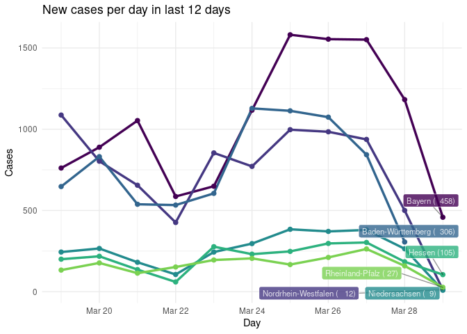<!-- -->

### New Deaths in states

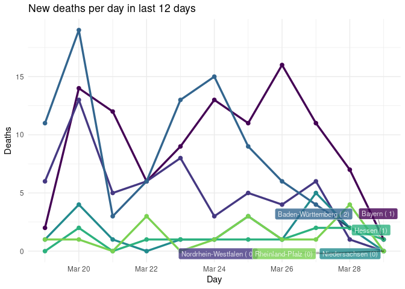<!-- -->

### New cases in districts

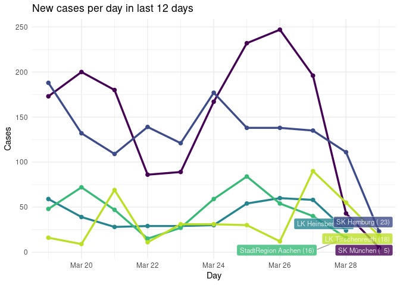<!-- -->

### New deaths in districts

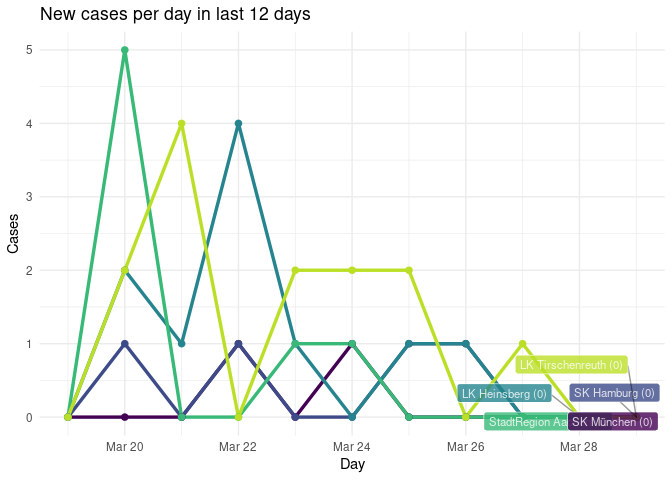<!-- -->

## Total cases in last 12 days in most affected states/districts

### Total cases in states

Showing only 6 states most affected

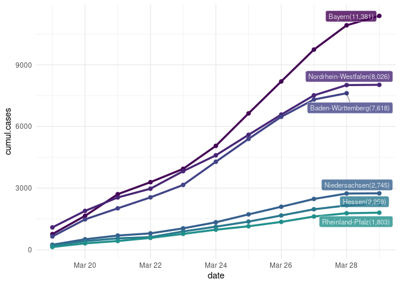<!-- -->

### Total deaths in states

Showing only 6 states most affected

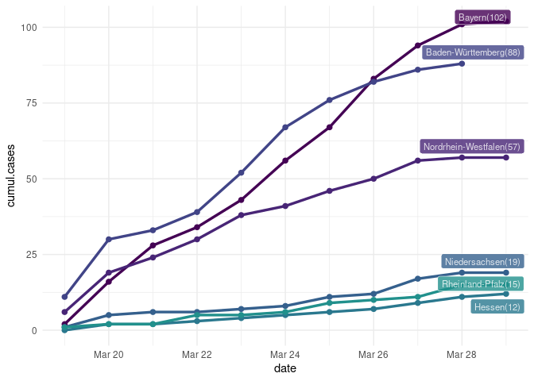<!-- -->

### Total cases in districs

Showing only 6 districs most affected

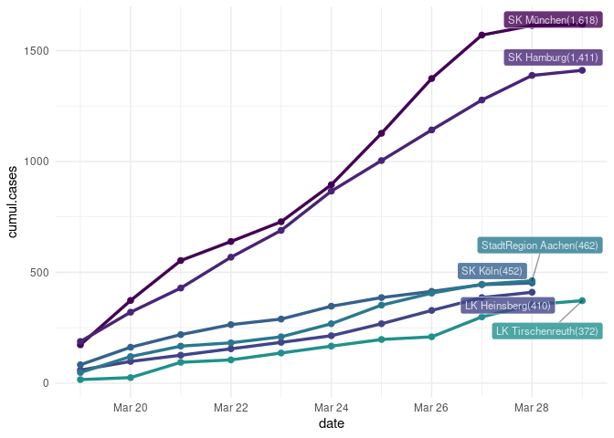<!-- -->

### Total deaths in districs

Showing only 6 districs most affected

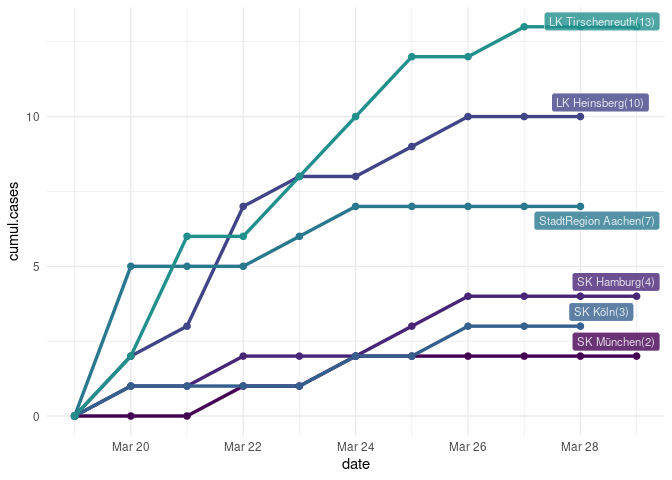<!-- -->

## Cases by age groups

### Cases in states

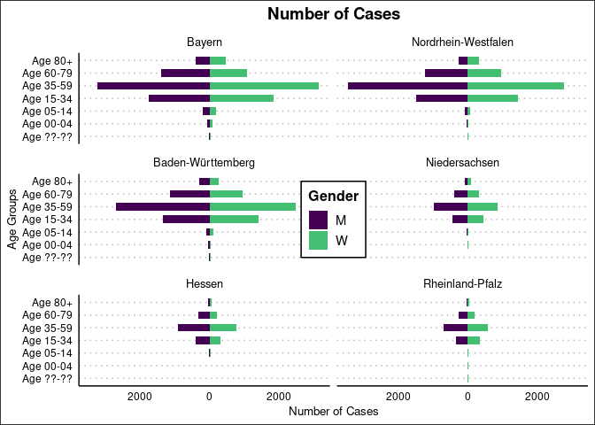<!-- -->

### Deaths in states

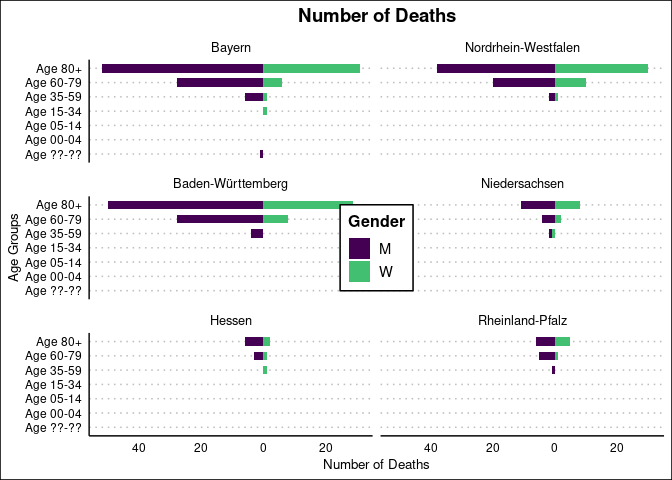<!-- -->

### Cases in districts

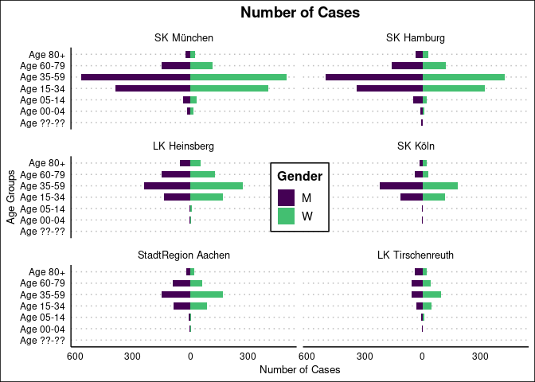<!-- -->

### Deaths in districts

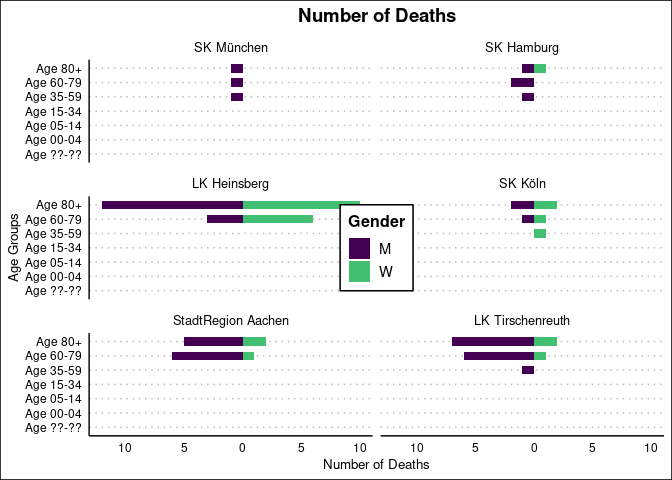<!-- -->
