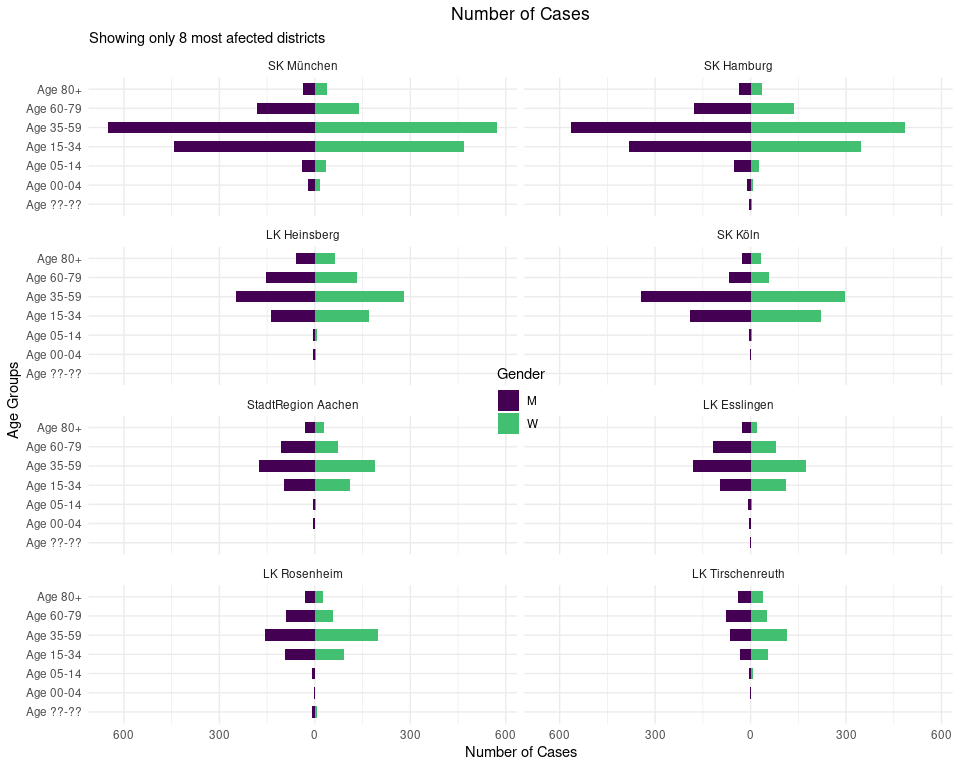
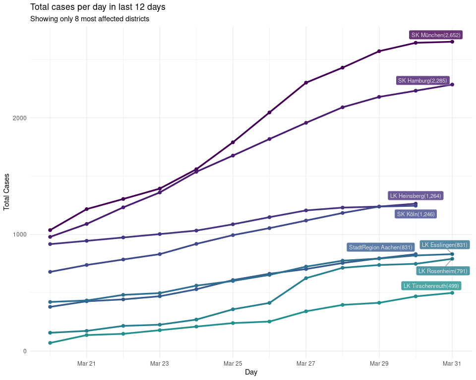
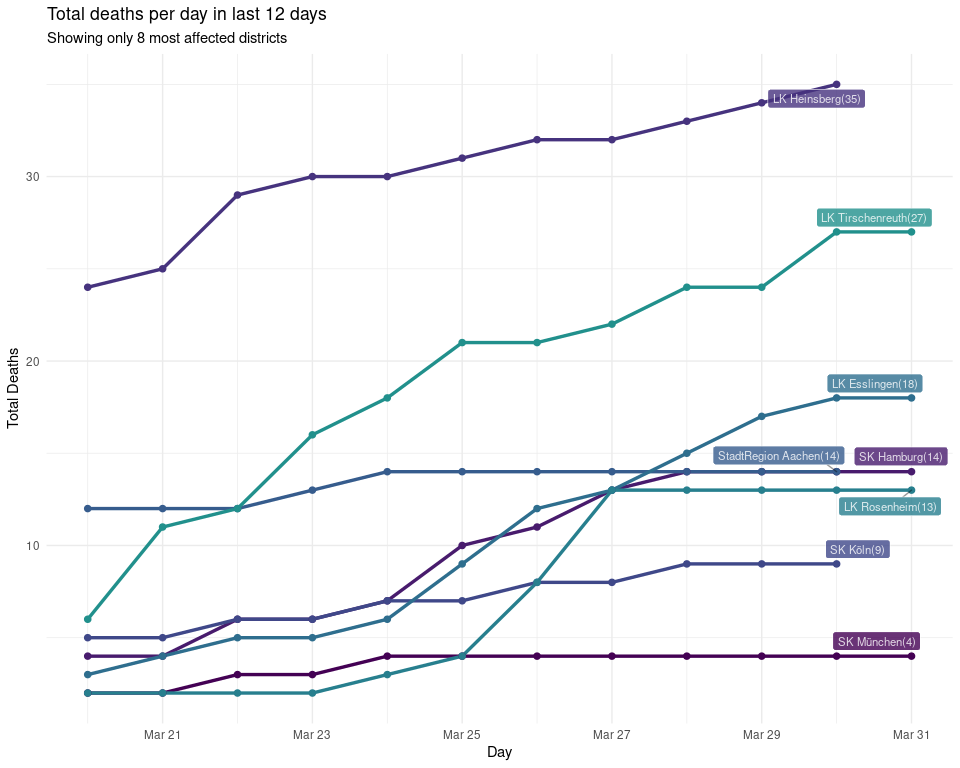

Germany data on district level
================

> COVID-19 District level data from Robert Koch Institute in Germany

The data is available inside the `data/` folder in `.csv` format. It can
also be used as an R package by installing this repository directly.

`BiocManager::install_github('averissimo/covid19-de_rki-data')` or
`devtools::install_github('averissimo/covid19-de_rki-data')`

To retrieve the lastest yourself use the
`rki.de.district.data::update.dataset()` function inside the R package.
Note that, as of now, the data is updated by the Robert Koch Institute
once a day.

It is downloaded from ARCGIS REST API using the
[RKI\_COVID19](https://services7.arcgis.com/mOBPykOjAyBO2ZKk/arcgis/rest/services/RKI_COVID19/FeatureServer/0/query?where=Meldedatum+%3E+\(CURRENT_TIMESTAMP+-+3\)&objectIds=&time=&resultType=none&outFields=*&returnIdsOnly=false&returnUniqueIdsOnly=false&returnCountOnly=false&returnDistinctValues=false&cacheHint=false&orderByFields=Meldedatum&outStatistics=&having=&resultOffset=&resultRecordCount=&sqlFormat=none&f=html&token=)
feature server.

## Update data in package

``` r
rki.covid19.tmp <- update.dataset()
## Downloading rows with the following 'where' clause: NOT ((ObjectId >= 560098 AND ObjectId <= 585873))
## Data is up to date, nothing to do...
```

## New cases/deaths per day in most affected states/districts

### New Cases in states

<!-- -->

### New Deaths in states

<!-- -->

### New cases in districts

<!-- -->

### New deaths in districts

<!-- -->

## Total cases in last 12 days in most affected states/districts

### Total cases in states

Showing only 6 states most affected

<!-- -->

### Total deaths in states

Showing only 6 states most affected

<!-- -->

### Total cases in districs

Showing only 6 districs most affected

<!-- -->

### Total deaths in districs

Showing only 6 districs most affected

<!-- -->

## Cases by age groups

### Cases in states

<!-- -->

### Deaths in states

<!-- -->

### Cases in districts

<!-- -->

### Deaths in districts

<!-- -->
