Germany data on district level
================

> COVID-19 District level data from Robert Koch Institute in Germany

The data is updated daily and is downloaded from a ARCGIS REST API using
the
[RKI\_COVID19](https://services7.arcgis.com/mOBPykOjAyBO2ZKk/arcgis/rest/services/RKI_COVID19/FeatureServer/0/query?where=Meldedatum+%3E+\(CURRENT_TIMESTAMP+-+3\)&objectIds=&time=&resultType=none&outFields=*&returnIdsOnly=false&returnUniqueIdsOnly=false&returnCountOnly=false&returnDistinctValues=false&cacheHint=false&orderByFields=Meldedatum&outStatistics=&having=&resultOffset=&resultRecordCount=&sqlFormat=none&f=html&token=)
feature server.

Data from previous dates can be changed over time and update the data
files accordingly, therefore `object.id` for any given row will change
daily.

Source code available at
[averissimo/covid19-rki\_de-data](https://github.com/averissimo/covid19.de.data).

**Other covid-19 confirmed/deaths analysis**

  - [World](https://averissimo.github.io/covid19-analysis/)
  - [Germany](https://averissimo.github.io/covid19-analysis/germany.html)
    *(by state)*
  - [Italy](https://averissimo.github.io/covid19-analysis/italy.html)
    *(by region)*
  - [Spain](https://averissimo.github.io/covid19-analysis/spain.html)
    *(by region)*

**Age group analysis**

  - [Germany](https://averissimo.github.io/covid19.de.data/) *(by state
    and district)*

## Install / Usage

The data is available inside the `data/` folder in `.csv` format.

It can also be used as an *R package* by installing this repository
directly:

``` r
BiocManager::install_github('averissimo/covid19.de.data')
# or
devtools::install_github('averissimo/covid19.de.data')
```

## Update data

To retrieve the lastest yourself use the following function of the R
package.

``` r
covid19.de.data::update_dataset()
covid19.de.data::update_dataset.no.age()
```

Note that, as of now, the data is updated by the Robert Koch Institute
once a day.

## Data visualization

### Cases by age groups in Germany

    ## `summarise()` regrouping output by 'state', 'age.group' (override with `.groups` argument)

<!-- -->

    ## `summarise()` regrouping output by 'state', 'age.group' (override with `.groups` argument)

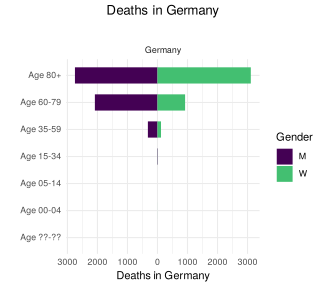<!-- -->

### Cases by day

*(showing only 3 latest days)*

    ## `summarise()` regrouping output by 'state', 'age.group', 'gender' (override with `.groups` argument)

#### 2020-08-21

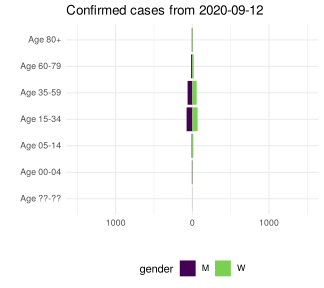<!-- -->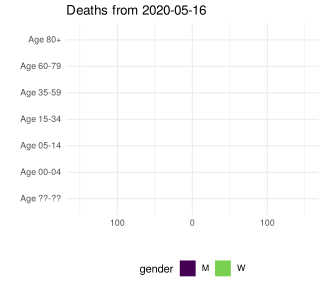<!-- -->

#### 2020-08-20

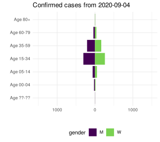<!-- --><!-- -->

#### 2020-08-19

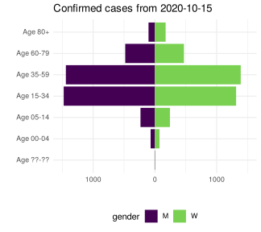<!-- --><!-- -->

### Cases by age groups

#### Cases in states

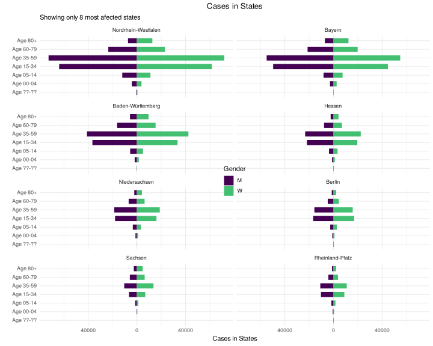<!-- -->

#### Deaths in states

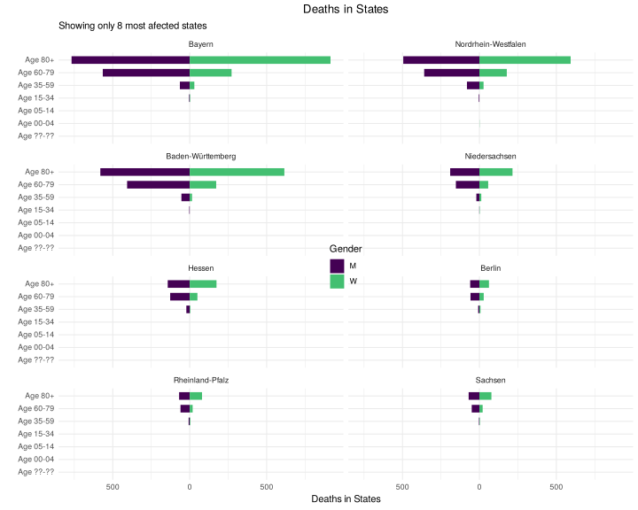<!-- -->

#### Cases in districts

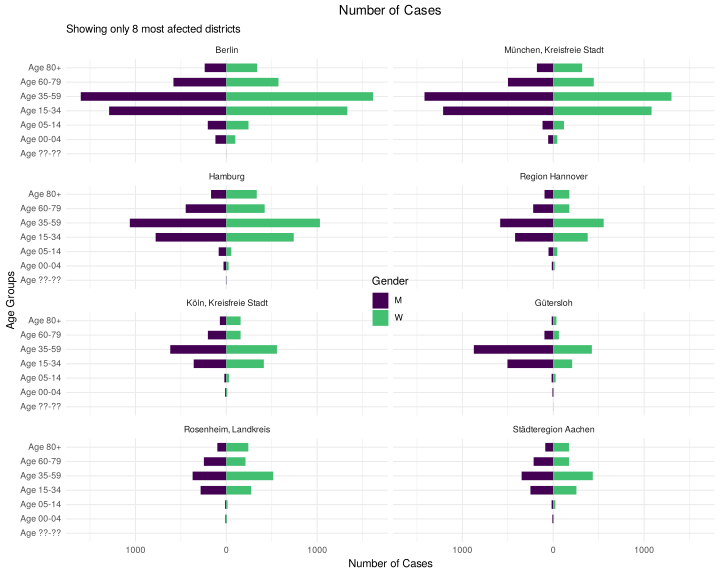<!-- -->

#### Deaths in districts

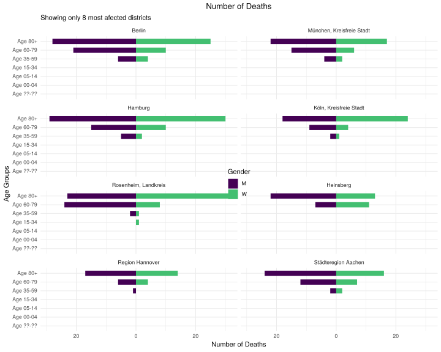<!-- -->

### Cases by Federal State

#### Confirmed cases

    ## `summarise()` ungrouping output (override with `.groups` argument)

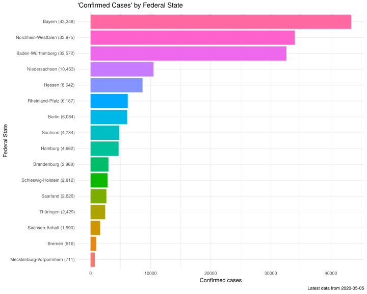<!-- -->

#### Deaths

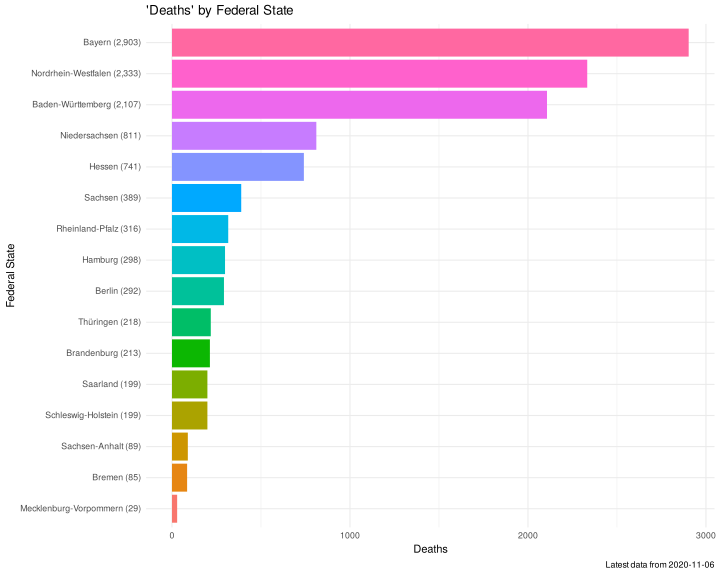<!-- -->

### Cases by Districts *(Showing only 50 districts with most cases/deaths)*

#### Confirmed cases

*Showing only 50*

    ## `summarise()` ungrouping output (override with `.groups` argument)

<!-- -->

#### Deaths

*Showing only 50*

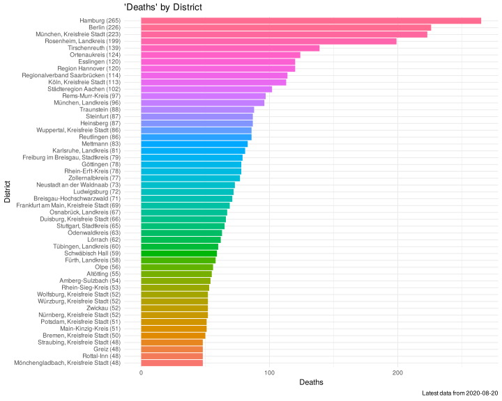<!-- -->

### New cases/deaths per day *in most affected states/districts*

#### New Cases in states

    ## `summarise()` regrouping output by 'state' (override with `.groups` argument)

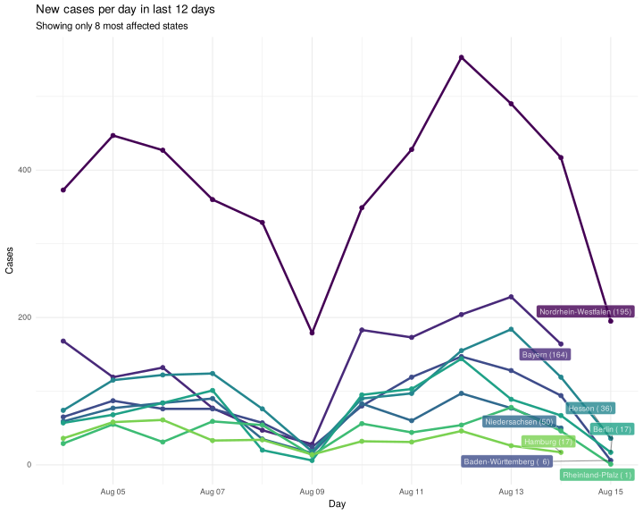<!-- -->

#### New Deaths in states

    ## `summarise()` regrouping output by 'state' (override with `.groups` argument)

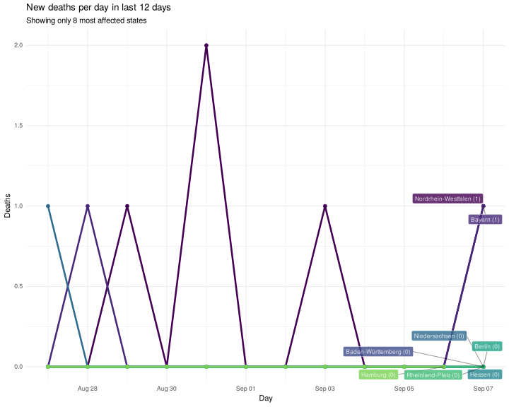<!-- -->

#### New cases in districts

    ## `summarise()` regrouping output by 'district' (override with `.groups` argument)

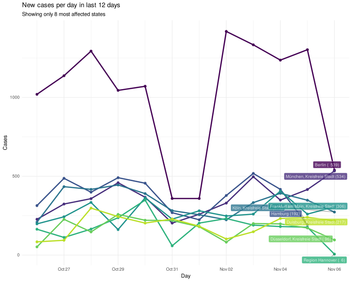<!-- -->

#### New deaths in districts

    ## `summarise()` regrouping output by 'district' (override with `.groups` argument)

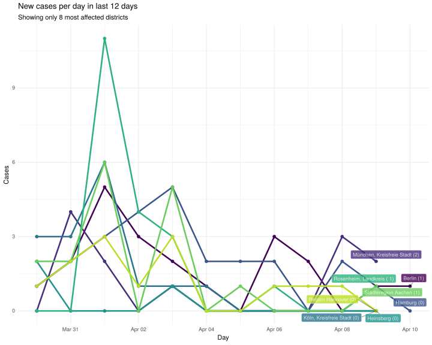<!-- -->

### Total cases in last 12 days *in most affected states/districts*

#### Total cases in states

    ## `summarise()` regrouping output by 'state' (override with `.groups` argument)

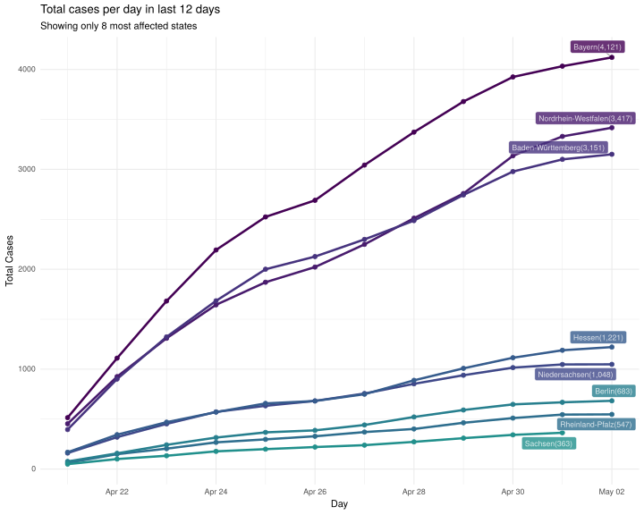<!-- -->

#### Total deaths in states

Showing only 6 states most affected

    ## `summarise()` regrouping output by 'state' (override with `.groups` argument)

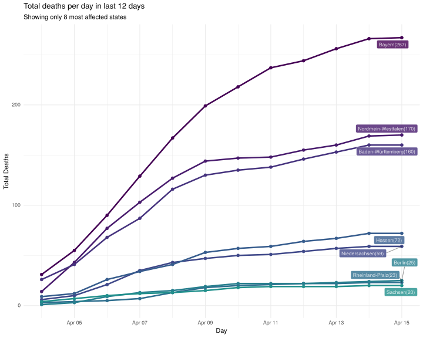<!-- -->

#### Total cases in districs

Showing only 6 districs most affected

    ## `summarise()` regrouping output by 'district' (override with `.groups` argument)

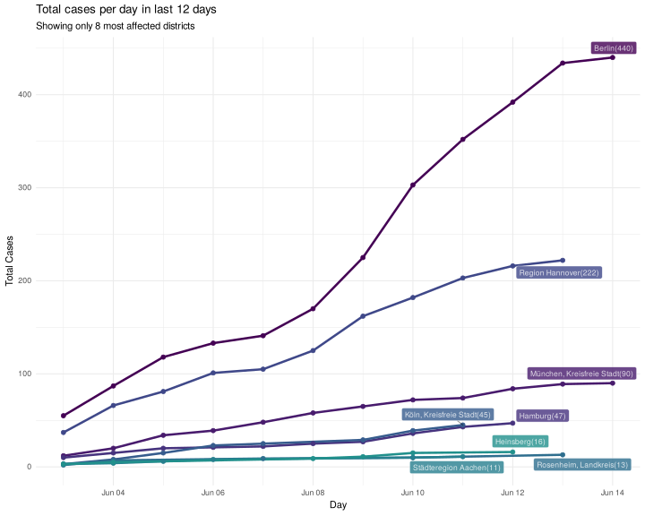<!-- -->

#### Total deaths in districs

Showing only 6 districs most affected

    ## `summarise()` regrouping output by 'district' (override with `.groups` argument)

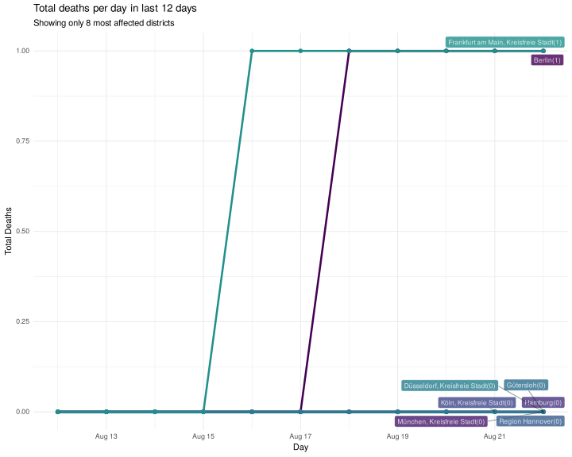<!-- -->
